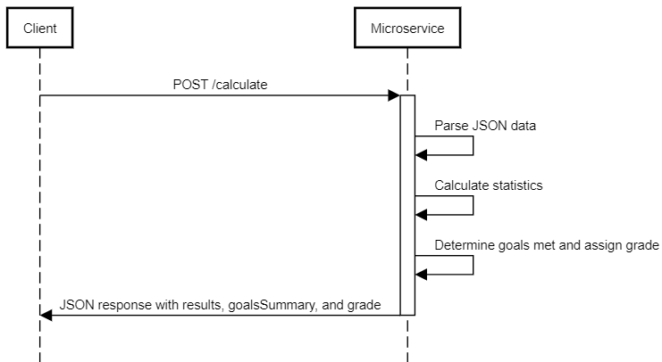

# Baseball Statistics Calculation Service

## Program implemented for a teammate as part of CS361

## Communication Contract

### Endpoint 
* **URL:** `http://localhost:3001/calculate` 
* **Method:** `POST` 
* **Content-Type:** `application/json` 

### Request 
#### Headers 
* `Content-Type: application/json`

#### Body
```
{
    "pitch_date": "string (YYYY-MM-DD)",
    "highest_recorded_mph": "number",
    "total_pitches": "number (integer)",
    "total_strikes": "number (integer)",
    "first_pitch_strikes": "number (integer)",
    "fastball_strikes": "number (integer)",
    "curveball_strikes": "number (integer)",
    "changeup_strikes": "number (integer)",
    "batters_faced": "number (integer)",
    "hits": "number (integer)",
    "walks": "number (integer)",
    "strikeouts": "number (integer)",
    "innings_pitched": "number",
    "total_fastballs": "number (integer)",
    "total_curveballs": "number (integer)",
    "total_changeups": "number (integer)"
}

```

#### Example Request
```
{
    "pitch_date": "2023-10-01",
    "highest_recorded_mph": 95.5,
    "total_pitches": 100,
    "total_strikes": 60,
    "first_pitch_strikes": 20,
    "fastball_strikes": 30,
    "curveball_strikes": 20,
    "changeup_strikes": 10,
    "batters_faced": 25,
    "hits": 5,
    "walks": 3,
    "strikeouts": 8,
    "innings_pitched": 7,
    "total_fastballs": 50,
    "total_curveballs": 30,
    "total_changeups": 20
}
```

### Response

#### Headers
* `Content-Type: application/json`

#### Body
```
{
    "results": {
        "totalStrikePercentage": "number (percentage, 2 decimal places)",
        "fastballStrikePercentage": "number (percentage, 2 decimal places)",
        "curveballStrikePercentage": "number (percentage, 2 decimal places)",
        "changeupStrikePercentage": "number (percentage, 2 decimal places)",
        "whip": "number (2 decimal places)",
        "kPerSeven": "number (2 decimal places)",
        "baa": "number (3 decimal places)",
        "firstPitchStrikePercentage": "number (percentage, 2 decimal places)"
    },
    "goalsSummary": {
        "totalGoalsMet": "string (e.g., '3/4')",
        "goalsAchieved": [
            "string (goal name)",
            ...
        ]
    },
    "grade": "string (A, B, C, D, F)"
}
```

#### Example Response
```
{
    "results": {
        "totalStrikePercentage": 60,
        "fastballStrikePercentage": 60,
        "curveballStrikePercentage": 66.67,
        "changeupStrikePercentage": 50,
        "whip": 1.14,
        "kPerSeven": 8,
        "baa": 0.2,
        "firstPitchStrikePercentage": 80
    },
    "goalsSummary": {
        "totalGoalsMet": "3/4",
        "goalsAchieved": [
            "First Pitch Strike Percentage",
            "Total Strike Percentage",
            "Curveball Strike Percentage"
        ]
    },
    "grade": "B"
}
```

### Validation Rules 
* **pitch\_date:** Must be a valid date in the format `YYYY-MM-DD`. 
* **highest\_recorded\_mph:** Must be a number. 
* **total\_pitches, total\_strikes, first\_pitch\_strikes, fastball\_strikes, curveball\_strikes, changeup\_strikes, batters\_faced, hits, walks, strikeouts, total\_fastballs, total\_curveballs, total\_changeups:** Must be integers. 
* **innings\_pitched:** Must be a number.

## UML Sequence Diagram


